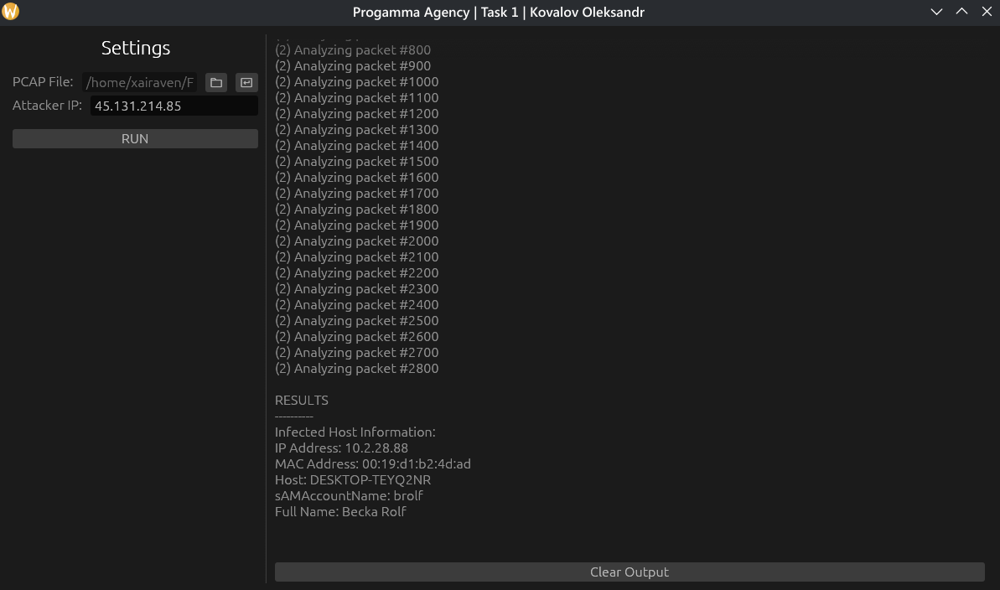

### Огляд програми

Програма -- GUI застосунок, написаний мовою Rust із застосуванням бібліотеки 
`egui` для створення інтерфейсу користувача. В якості парсеру пакетів 
застосовується `rtshark`, який є обгорткою над консольним інструментом `tshark`. 
Основна мета програми -- аналіз файлів мережевого дамп-трафіку (PCAP) для виявлення 
заражених хостів та вилучення артефактів їхньої ідентифікації в середовищі Active Directory.

### Архітектурний підхід

Для того, щоб уникнути зависання інтерфейсу під час обробки важких файлів, рушій аналізу 
винесено в окремий фоновий потік. Комунікація між фоновим потоком та графічним інтерфейсом 
відбувається за допомогою неблокуючих каналів `crossbeam`, якими передаються події прогресу парсингу 
та готові результати.

### Алгоритм аналізу (Two-Pass Analysis)
Аналіз трафіку побудований на архітектурі двох проходів, яка ефективно вирішує інженерну 
проблему хронологічної розбіжності мережевих подій. Суть проблеми полягає в тому, що пакети 
з іменами (автентифікація та завантаження профілю) зазвичай з'являються в дампі набагато раніше, 
ніж пакети шкідливого трафіку до сервера управління (C2). На етапі ініціалізації програма формує 
жорсткий фільтр відображення для `tshark`, який включає IP-адресу атакуючого та ключові протоколи 
ідентифікації: `ldap`, `cldap`, `nbns`, `llmnr`, `kerberos`, `samr`, `dcerpc` та `smb2`. Цей підхід 
відсікає весь зайвий мережевий шум ще до генерації масивного XML-коду, що радикально зменшує 
навантаження на процесор і прискорює роботу програми в сотні разів.  
Під час першого проходу рушій сканує відфільтрований трафік виключно для виявлення скомпрометованих 
машин. Він перевіряє IP-адреси призначення кожного пакета, і якщо пакет відправляється до хакерського 
сервера, відправник реєструється у хеш-мапі як підтверджена жертва разом із відповідною MAC-адресою 
з рівня Ethernet. Другий прохід виконує цільове вилучення артефактів для вже відомих і підтверджених 
жертв. Програма знову ітерує відфільтрований потік і перевіряє, чи присутня IP-адреса відправника або
отримувача пакета в хеш-мапі заражених хостів. Якщо так, рушій заглиблюється в метадані протоколів. 

Ім'я комп'ютера (Hostname) витягується з пакетів NBNS, LDAP або LLMNR з паралельним очищенням 
від XML-сутностей та технічних суфіксів NetBIOS. 

Логін користувача (sAMAccountName) дістається з поля CNameString протоколу Kerberos з автоматичним 
ігноруванням внутрішніх системних акаунтів Windows. 

Повне ім'я (Display Name) вилучається з відповідей протоколу SAMR, який часто інкапсулюється в DCERPC, 
шляхом ітерування всіх полів для знаходження розкодованого значення.  

Після завершення обох етапів читання, рушій компілює зібрані профілі з хеш-мапи та відправляє готовий 
масив об'єктів `InfectedHostInfo` через канал зв'язку до фронтенду для фінального рендеру на екрані. 

### Візуалізація та інтерфейс користувача

Обираємо файл дампу, вводимо IP зловмисника, запускаємо процес, отримуємо результат.

### Запуск та використання
Для запуску треба Rust та Cargo, бо не було вимоги надати скомпільований виконуваний файл.
Можна або запустити власноруч в середовищі RustRover за допомогою конфігурації з каталогу `.run`,
яка підтянеться автоматично, або ж запустити скрипт [*shell*](../../Task1/start.sh).

### Нюанси
Програма оптимізована для роботи з великими дампами, але все ж таки може займати деякий час 
на обробку, залежно від розміру файлу та потужності комп'ютера.

Міг би використовуватися мій власний аналізатор трафіку -- бібліотека `dpi` з проекту `xailyser`
[(посилання)](https://github.com/xairaven/xailyser), але через обмеження часу та складність реалізації 
підтримки всіх необхідних протоколів, було прийнято рішення використати `rtshark`, який вже має вбудовану 
підтримку широкого спектру мережевих протоколів та ефективно обробляє великі обсяги даних. 
Це дозволило зосередитися на логіці аналізу та оптимізації, а не на розробці власного парсеру, 
що значно прискорило процес розробки та забезпечило надійність результатів.

Також, так як це тестове завдання, не була реалізована валідація даних та додаткова оптимізація використаних методів.
