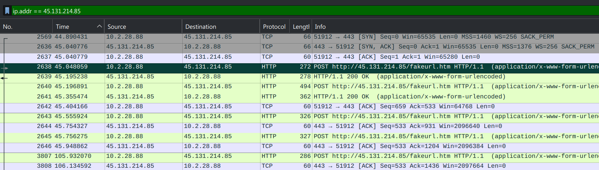
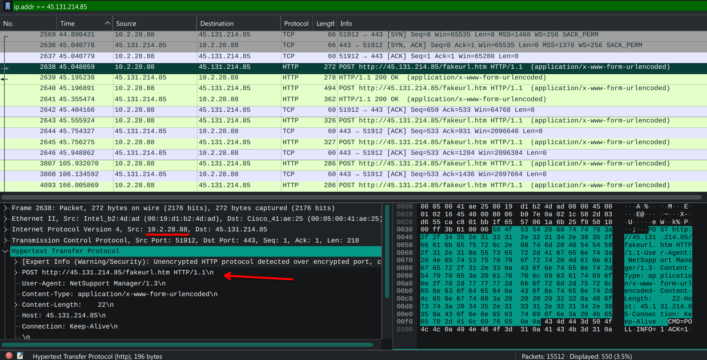
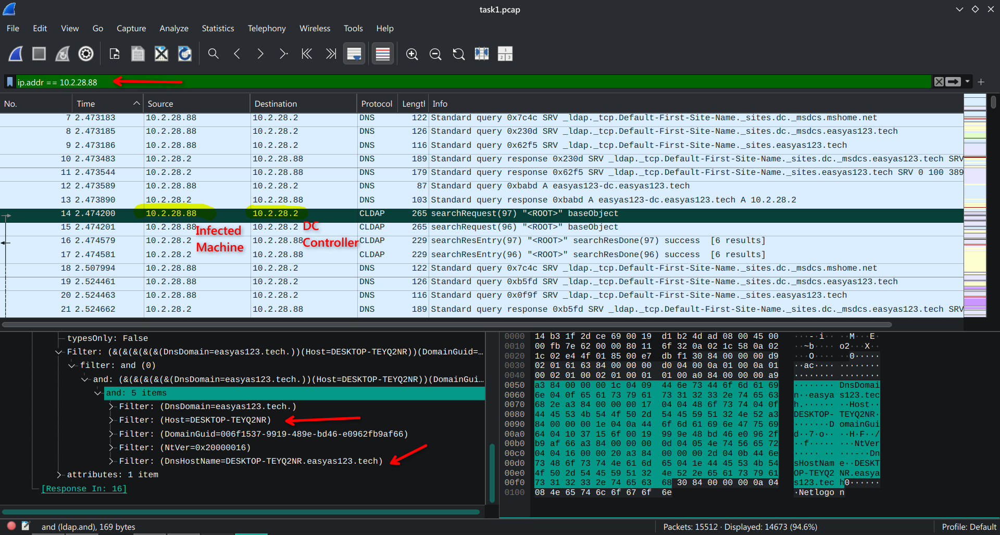
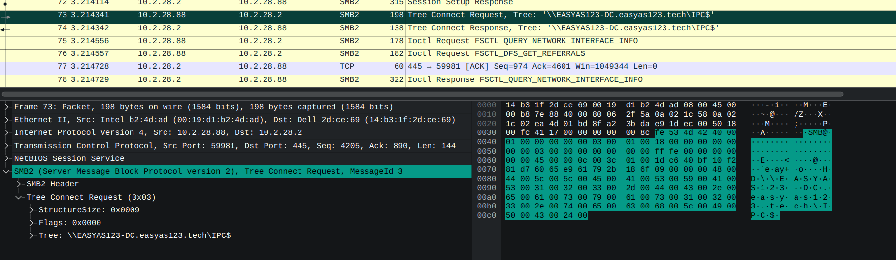
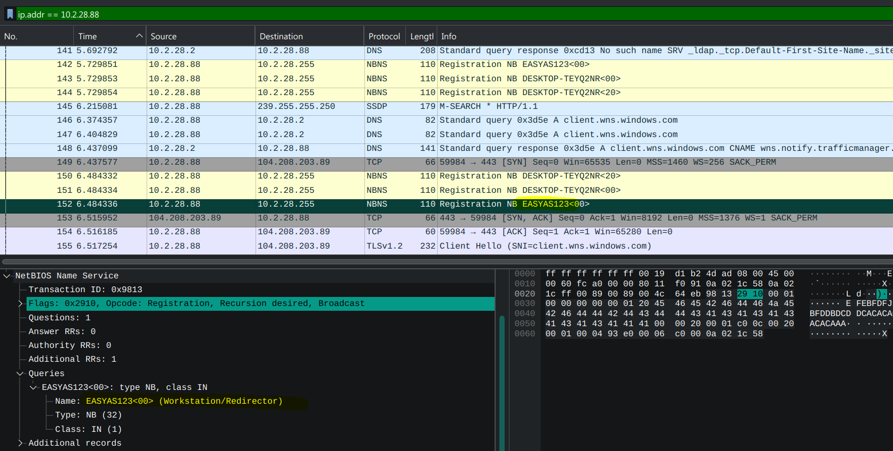
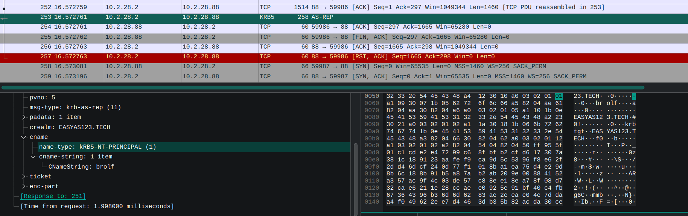
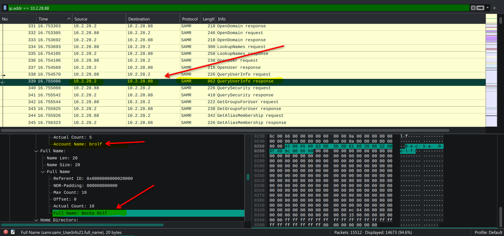

Для початку, застосуємо фільтр по IP-адресі нападника, щоб отримати записи, пов'язані з ним.
Таким чином, можемо відфільтрувати трафік, бо маємо багато сміття: наприклад, ARP запити.

Бачимо неприємні знаки: хост *10.2.28.88*, який, ймовірно, є зараженим, 
надсилає нападнику (*45.131.214.85*) трафік на 443 порт, який зазвичай використовується для HTTPS.
Але, бачимо попередження, що трафік не зашифрований, часто така конфігурація використовується (?)
для обходу IDS. Ну і звичайно, User-Agent: NetSupport Manager 1.3, 
який є відомим RAT (Remote Access Trojan) і часто використовується для віддаленого керування зараженими машинами.

Тобто, маємо:
- **Infected Machine IP**: 10.2.28.88
- **Infected Machine MAC**: 00:19:d1:b2:4d:ad (Intel_b2:4d:ad)
- **Attacker Machine IP**: 45.131.214.85
- **Attacker Machine MAC**: 00:05:00:41:ae:25 (Cisco_41:ae:25)

З фільтром на адресу інфікованої машини знаходимо пакети CLDAP. Отримуємо дані:

- **Hostname**: DESKTOP-TEYQ2NR
- **FQDN**: DESKTOP-TEYQ2NR.easyas123.tech

Також, маємо додаткову інформацію, що Domain Controller (DC, Active Directory) 
має адресу 10.2.28.2 (але це й так відомо адміністратору локальної мережі).

Паралельно, бачимо SMB запити від інфікованої машини до DC, які потенційно можуть теж бути від зловмисника.

Схоже, що це не має відношення до інциденту, але зафіксуємо -- інфікована машина 
реєструється в групі `EASYAS123`.

З Kerberos пакету отримуємо ім'я користувача -- *brolf*. Realm -- *EASYAS123.TECH*

Далі, недовго шукаючи, навіть без фільтра на *brolf*, знаходимо повне ім'я користувача -- *Becka Rolf*

### Результат:
- **IP-адреса жертви**: 10.2.28.88
- **MAC-адреса жертви**: 00:19:d1:b2:4d:ad (Intel_b2:4d:ad)
- **IP-адреса атакуючого**: 45.131.214.85
- **MAC-адреса атакуючого**: 00:05:00:41:ae:25 (Cisco_41:ae:25)
- **Hostname**: DESKTOP-TEYQ2NR
- **Логін активного користувача (sAMAccountName)**: brolf
- **Повне ім'я користувача (display name)**: Becka Rolf