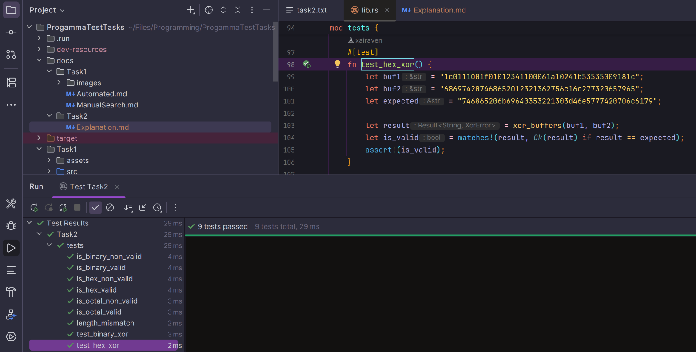

### Огляд програми

Програма є бібліотекою, написаною мовою Rust. Основна мета полягає у виконанні побітового XOR 
над двома рядковими буферами однакової довжини, які можуть бути представлені у двійковій, 
вісімковій або шістнадцятковій системах числення, з поверненням результату в тій самій системі.

### Архітектурний підхід
Реалізована функція `xor_buffers` приймає два рядкові буфери та виконує операцію XOR 
над кожним символом, враховуючи їхню систему числення. Результат повертається у вигляді рядка, 
який відповідає системі числення вхідних даних. Або ж користувач може отримати помилку із заздалегідь
визначеної множини -- `XorError`.

### Алгоритм обробки (XOR Logic)

Для кожного вхідного буфера незалежно визначається його система числення. 
Якщо бази збігаються, програма виконує посимвольну конвертацію символів у числа, 
проводить над ними математичну операцію XOR та здійснює зворотне перетворення результату 
в символ відповідної системи числення.

### Візуалізація та інтерфейс користувача

Це не застосунок, тому інтерфейсу немає. Але, реалізовані тести, які можна запустити за допомогою 
заздалегідь визначеної конфігурації для IDE або ж скрипту [*shell*](./../../Task2/start.sh).

### Нюанси

Під час розробки було реалізовано оптимізацію роботи з пам'яттю за допомогою попереднього виділення 
ємності для результуючого рядка, що запобігає зайвим алокаціям. Також враховано нюанси автовизначення 
систем числення: для уникнення хибних спрацювань алгоритм перевіряє рядки, починаючи з найвужчої підмножини 
символів (двійкова база) і закінчуючи найширшою (шістнадцяткова база).