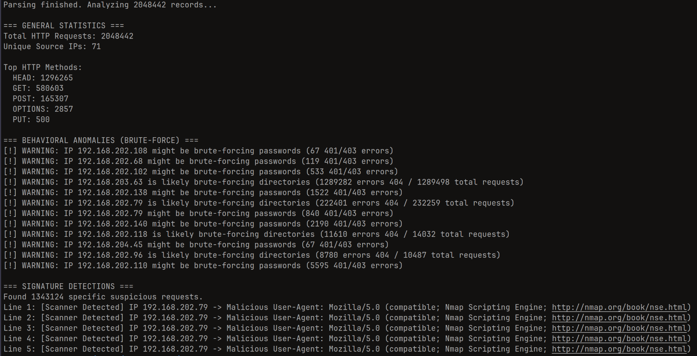
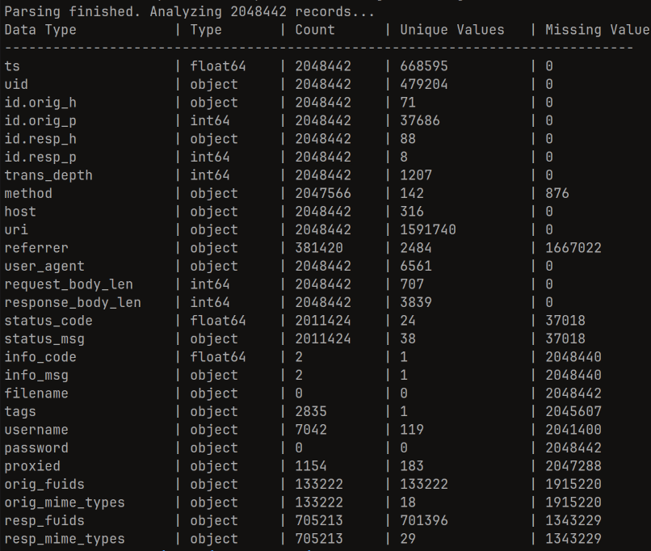

### Огляд програми

Програма є консольною (CLI) утилітою, написаною мовою Rust. Її основна мета -- швидкий та 
безпечний парсинг масивних журналів HTTP-з'єднань формату Zeek IDS (`http.log`), агрегація 
мережевої статистики, автоматизоване виявлення кібератак, а також динамічна генерація метаданих 
датасету.

### Архітектурний підхід

Для забезпечення максимальної швидкодії та ефективного використання пам'яті 
(враховуючи розмір файлу у понад 2 мільйони рядків), програма читає файл потоково через `BufReader`. 
Замість використання важких сторонніх бібліотек для серіалізації, реалізовано власну імплементацію 
трейту `TryFrom` для безпечного мапінгу сирих рядків у структуру `JournalEntry`.

### Ключові архітектурні рішення:

**Безпечна обробка Zeek-формату:** Коректне ігнорування заголовків з # (за наявності, можливість така є) та 
парсинг специфічних порожніх значень (`-` та `(empty)`).

**Кастомний Enum для HTTP-методів**: Використання типу `HTTPMethod` із Fallback-варіантом `Other(String)`, 
що запобігає падінню парсера під час обробки навмисно спотвореного хакерського трафіку.

**Захист від переповнення:** Використання розширених типів (`u64` для розміру тіла запитів/відповідей, 
`u32` для глибини транзакцій) гарантує стабільність на реальному мережевому трафіку.

**Структуроване логування:** Інтеграція крейтів `log` та `fern` для запису подій у файлову 
систему з ротацією (якщо треба використовувати `logrotate`) за датою.

### Алгоритм обробки та Аналітика

Аналітичний рушій програми (модуль `Analyzer`) працює у двох незалежних режимах, 
які обираються через аргументи командного рядка.

#### Режим 1: Аналіз безпеки та Статистика (За замовчуванням)

Дані проходять три етапи перевірки:

**Базова статистика:** Агрегація кількості запитів, унікальних IP-адрес джерел та найпопулярніших HTTP-методів.

**Поведінковий аналіз (Евристика)**: Виявлення аномалій на основі статистичних відхилень.

**Directory Brute-forcing**: Якщо IP-адреса здійснює понад 100 запитів і більше ніж 80% з 
них отримують статус `404 Not Found`.

**Password Brute-forcing**: Фіксація аномальної кількості помилок доступу `401/403` від одного джерела.

**Сигнатурний аналіз:** Глибока перевірка метаданих запиту за можливості

**Парсинг User-Agent** на наявність сканерів уразливостей (Nmap, sqlmap, DirBuster, Nikto тощо).

**Аналіз URI** на наявність спроб експлуатації (Path Traversal, SQL-ін'єкції, доступ до `.env` чи `/etc/passwd`).

#### Режим 2: Генерація Словника Даних (--schema-report)

Програма має вбудований інструмент Data Science для профілювання даних. Замість хардкоду 
значень, утиліта використовує оптимізовані макроси Rust (`count_req!` та `count_opt!`) разом 
із HashSet, щоб за лічені секунди проітерувати всі 2 мільйони рядків та динамічно вирахувати 
типи даних, загальну кількість, кількість унікальних (Unique) та пропущених (Missing) значень 
для кожного з 27 полів логу.

### Результати аналізу реального дампу

Під час тестування на наданому файлі `http.log` (2,048,442 записи) програма успішно 
відтворила таблицю метаданих та виявила масовану багатовекторну кібератаку:

**Агресивне веб-сканування:** Виявлено понад 1.29 млн запитів з методом HEAD.

**Directory Brute-force:** Виявлено хости, що здійснювали перебір директорій. Найбільш 
активний IP (`192.168.203.63`) згенерував понад 1.28 мільйона помилок `404 Not Found`.

**Password Brute-force:** Зафіксовано спроби підбору облікових даних від групи 
IP-адрес (наприклад, `192.168.202.110` з 5595 помилками доступу).

**Сигнатурні виявлення:** Зафіксовано понад 1.34 мільйона запитів від 
розвідувального рушія Nmap Scripting Engine.

### Візуалізація та інтерфейс користувача

Взаємодія відбувається через консольний CLI-інтерфейс (`clap`). Користувач може запускати 
глибокий аналіз інцидентів або генерувати звіт про метадані:

```bash
# Запуск SOC-аналізатора загроз.
cargo run --release -- --file http.log

# Запуск профайлера даних (Data Schema).
cargo run --release -- --file http.log --schema-report
```

Приклад виводу для режиму аналізу загроз:



Приклад виводу для режиму генерації метаданих:



### Нюанси

Додаткову увагу було приділено оптимізації роботи з пам'яттю (Memory Footprint). 
Під час пошуку загроз в ОЗП зберігається не весь об'єм даних файлу, а лише агреговані метрики, 
що прив'язані до унікальних IP-адрес. Це забезпечує складність O(1) по пам'яті 
відносно кількості вхідних рядків і дозволяє аналізувати гігабайтні дампи 
трафіку навіть на слабких машинах.